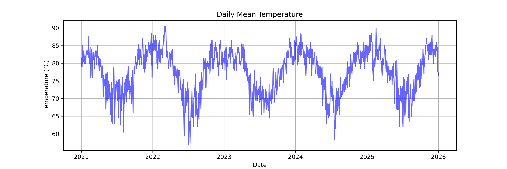
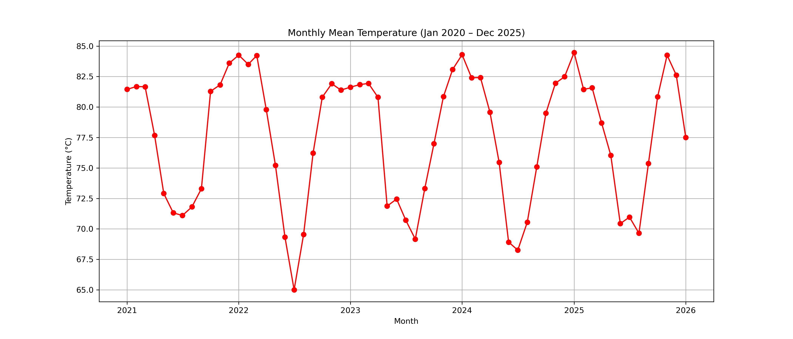
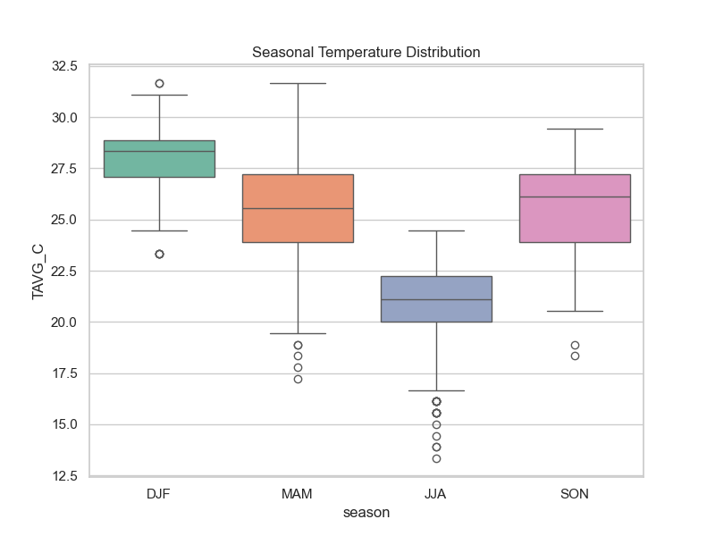

# Climate Data Basics (Weeks 1–2)

This repository contains introductory projects in Python for climate and environmental data analysis.  
It demonstrates skills in data cleaning, visualization, and handling multidimensional climate datasets.

---

## 📂 Contents
- **Week 1:** Data cleaning and plotting with pandas, numpy, matplotlib, seaborn.
- **Week 2:** ERA5 temperature trend analysis with xarray.

---

## 📊 Outputs
- Jupyter notebooks in `/notebooks`
- Plots in `/plots`
- Sample datasets in `/data`

## Example plots






---

## 🌍 Data Sources
- **NOAA Daily Temperature (CSV):** [NOAA Climate Data Online](https://www.ncei.noaa.gov/cdo-web/)
- **ERA5 Reanalysis:** [Copernicus Climate Data Store](https://cds.climate.copernicus.eu/)

---

## 🚀 How to Run
1. Clone the repo:
   ```bash
   git clone https://github.com/yourusername/climate-data-basics.git
